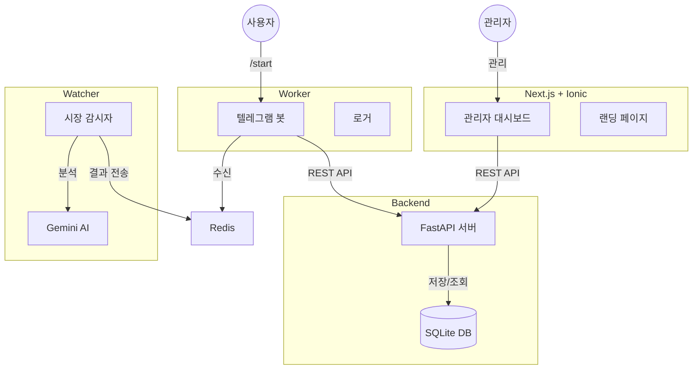

# 📘 Reason Hunter 시스템 매뉴얼

## 1. 🏗️ 시스템 아키텍처 (구성도)
이 시스템은 4개의 독립적인 구성 요소로 이루어져 있으며, **FastAPI** (REST 통신)와 **Redis** (실시간 메시지 전송)를 통해 유기적으로 작동합니다.



---

## 2. 🚀 빠른 시작 가이드 (터미널 4개 필요)

이 시스템을 구동하려면 **4개의 터미널 창**을 열고 각각 아래 명령어를 실행해야 합니다.

### 1️⃣ 백엔드 서버 (Backend: 두뇌)
데이터베이스(사용자 정보, 로그)를 관리하고 API를 제공합니다.
```bash
# 터미널 1
uvicorn backend.main:app --host 0.0.0.0 --port 8000 --reload
```
- **포트**: 8000
- **API 문서**: `http://localhost:8000/docs`

### 2️⃣ 워커 (Worker: 입/메신저)
텔레그램 봇을 구동합니다. 사용자 명령을 처리하고, 결제를 확인하며, 분석 결과를 텔레그램으로 발송합니다.
```bash
# 터미널 2
python -m worker.main
```

### 3️⃣ 왓처 (Watcher: 눈/감시자)
주식 시장과 SNS를 24시간 감시합니다. 데이터를 수집하고 AI 분석을 수행한 뒤 Redis로 신호를 보냅니다.
```bash
# 터미널 3
python -m watcher.main
```

### 4️⃣ 프론트엔드 (Frontend: 얼굴/관리자)
관리자 대시보드 및 사용자용 소개 페이지입니다.
```bash
# 터미널 4
cd frontend
npm run dev
```
- **주소**: `http://localhost:3000`
- **관리자 페이지**: `http://localhost:3000/admin`

---

## 3. 🛡️ 주요 기능 및 사용법

### A. 💰 VIP 결제 & 자동 활성화
관리자의 수동 승인 없이, 결제 즉시 자동으로 VIP 등급이 활성화됩니다.

| 이용권 종류 | 혜택 (기간) | 시크릿 링크 양식 |
| :--- | :--- | :--- |
| **1개월권** | +33 일 | `...start=req_1m_SECRET_1M_2026` |
| **6개월권 (3+3)** | +186 일 | `...start=req_6m_SECRET_6M_2026` |
| **1년권** | +368 일 | `...start=req_1y_SECRET_1Y_2026` |

> **설정**: 비밀키(`SECRET_...`) 변경은 `common/config.py`에서 가능합니다.

### B. 👥 추천인 시스템 (Referral)
사용자가 친구를 초대할 수 있으며, 누가 누구를 초대했는지 추적합니다.
- **초대 링크**: `t.me/Stock_Now_Bot?start=ref_사용자ID`
- **확인 방법**: 관리자 대시보드 > "Referrer" 열 확인.

### C. 👮 관리자 대시보드 (`/admin`)
구독자를 한눈에 보고 관리합니다. 더 이상 만료된 사용자를 찾아다닐 필요가 없습니다.
- **빨간 날짜**: 만료된 사용자 (시각적 알림).
- **`[+1M]` 버튼**: 1개월 연장 + PRO 등급 승급 (입금 확인 시 클릭).
- **`[+2M]` 버튼**: 2개월 연장 + PRO 등급 승급.
- **`[🔽]` 버튼**: 무료(FREE) 등급으로 강등 + 만료일 제거 (서비스 중단).

### D. 🧠 문맥 인식 AI 분석 (Context-Aware)
AI가 최근 시장 상황(Macro)을 "기억"하고 개별 종목(Micro)을 분석합니다.
- **작동 방식**: 급등 감지 -> 최근 7일간의 시장 브리핑/트럼프 분석 조회 -> 문맥을 반영하여 분석 -> 봇 발송.

---

## 4. 📁 프로젝트 폴더 구조
- `backend/`: FastAPI 서버 코드 (DB 모델, API 엔드포인트).
- `worker/`: 텔레그램 봇 로직 (`python-telegram-bot` 사용).
- `watcher/`: 감시자 로직 (`Kiwoom` 증권, `RankPoller` 실시간 순위, `NewsWorker` 뉴스).
- `frontend/`: Next.js 웹사이트 코드.
- `common/`: 공통 설정 파일 (`config.py`) 및 로거.
- `data/`: SQLite 데이터베이스 파일 (`subscribers.db`, `market_logs.db`).

## 5. ⚠️ 문제 해결 (Troubleshooting)
- **봇이 응답이 없나요?** -> 터미널 2번 (`worker`)을 확인/재시작하세요.
- **알림이 안 오나요?** -> 터미널 3번 (`watcher`) 로그를 확인하거나 Redis가 켜져 있는지 확인하세요.
- **저장이 안 되나요?** -> 터미널 1번 (`backend`) 로그를 확인하세요.
- **시크릿 링크가 작동을 안 해요?** -> `config.py`를 수정한 뒤 `worker`를 재시작했는지 확인하세요.
