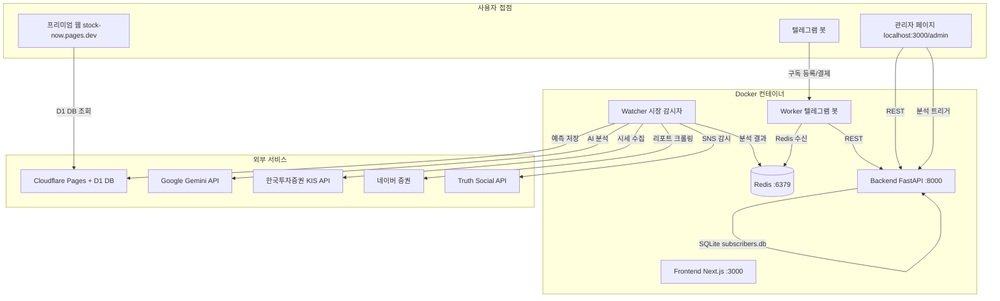

# 📘 Stock Now 시스템 매뉴얼

> 최종 업데이트: 2026-04-01

---

## 1. 🏗️ 시스템 아키텍처

5개의 Docker 컨테이너로 구성되며, **Redis** (실시간 메시지 브로커) + **FastAPI** (REST API) + **Cloudflare D1** (프로덕션 DB)를 중심으로 작동합니다.



---

## 2. 🐳 Docker 구성 (운영 환경)

모든 서비스는 `docker-compose.yml` 하나로 관리됩니다.

| 컨테이너 | 이름 | 포트 | 역할 |
|---|---|---|---|
| Redis | `reason_redis` | 6379 | 메시지 브로커 |
| Backend | `reason_backend` | 8000 | 구독자 DB + `/analyze` API |
| Worker | `reason_worker` | - | 텔레그램 봇 + 메시지 발송 |
| Watcher | `reason_watcher` | - | 시장 감시 + AI 예측 생성 |
| Frontend | `reason_frontend` | 3000 | 관리자 페이지 (로컬) |

### 전체 시작
```bash
docker compose up -d
```

### 개별 재시작
```bash
docker compose restart backend
docker compose restart worker
docker compose restart watcher
docker compose restart frontend
```

### 로그 확인
```bash
docker compose logs watcher --tail=100 -f
docker compose logs worker --tail=100 -f
```

---

## 3. 🌐 프론트엔드 이중 구조

프론트엔드가 **두 개**로 분리되어 있습니다.

| | `frontend/` | `frontend_web/` |
|---|---|---|
| **역할** | 관리자 도구 (로컬 전용) | 프리미엄 서비스 웹 (배포) |
| **실행** | `npm run dev` (포트 3000) | `npm run pages:deploy` |
| **호스팅** | Docker 컨테이너 | Cloudflare Pages |
| **DB** | Backend SQLite | Cloudflare D1 |
| **인증** | 없음 (로컬) | NextAuth (구글 로그인) |

### frontend/ 주요 페이지
- `/admin` — 구독자 관리 (Tier, 만료일, 추천인)
- `/admin/analyze` — PDF 리포트 수동 분석 트리거

### frontend_web/ 주요 페이지
- `/` — 랜딩 페이지
- `/auth/signin` — 구글 로그인
- `/(premium)/consensus` — 메인 컨센서스 대시보드 (Fear&Greed, VIX 게이지, 예측 카드, AI 주간 요약)
- `/(premium)/history` — 예측 성과 기록 (적중률, 월별 통계)
- `/(premium)/trump` — 트럼프 마켓 임팩트
- `/dashboard` — 사용자 대시보드
- `/features` — 기능 소개

### 배포

| 환경 | 명령어 | URL | D1 DB |
|------|--------|-----|-------|
| **개발 (Windows)** | `npm run pages:deploy:dev` | `stock-now-dev.pages.dev` | `stock-now-dev-database` |
| **운영** | `npm run pages:deploy` | `stock-now.pages.dev` | `stock-now-database` |

> ⚠️ Cloudflare Pages 배포는 **Windows에서만** 합니다. 맥북은 Docker만 담당.

---

## 4. 🔭 Watcher — 감시 태스크 목록

`watcher/tasks/` 하위 파일들이 `watcher/main.py`에서 `asyncio.gather()`로 동시 실행됩니다.

| 파일 | 주기 | 역할 |
|---|---|---|
| `condition_watcher.py` | 실시간 (20초) | 🇰🇷 국내 조건검색 급등주 포착 → 텔레그램 알림 |
| `condition_watcher_us.py` | 실시간 (20초) | 🇺🇸 미국 조건검색 급등주 포착 → 텔레그램 알림 |
| `rank_poller.py` | 하루 3회 (08:50, 12:40, 16:30 KST) | 🇰🇷 국내장 등락 순위 브리핑 |
| `rank_poller_2.py` | 하루 3회 (22:50, 02:40, 05:30 KST) | 🇺🇸 미국장 등락 순위 브리핑 |
| `trump_watcher.py` | 2분마다 | 🏛 트럼프 Truth Social 모니터링 (최신 5개 체크) |
| `report_watcher.py` | 1시간마다 (평일 09~18 KST) | 📑 네이버 증권 주간 리포트 자동 수집 + BlackRock |
| `whale_watcher_kr.py` | 20초마다 | 🐳 국내 거래량/수급 현황판 (Telegraph) |
| `whale_watcher_us.py` | 20초마다 | 🐳 미국 거래량 현황판 (Telegraph) |
| `macro_watcher.py` | 30분마다 | 📊 CNN Fear&Greed + CBOE VIX 수집 → D1 저장 |
| `consensus_summary_watcher.py` | 6시간마다 | 🧠 AI 주간 컨센서스 요약 생성 (Gemini + Google Search) |
| `wallstreet_watcher.py` | 24시간마다 | 📈 월가 컨센서스 (목표가, 투자의견) 수집 |
| `prediction_price_updater.py` | 하루 2회 (KST 15:40 KR, 06:10 US) | 💹 예측 OHLC 기반 hit/miss 판정 + peak 갱신 |

### 자동 재기동
Watcher는 매일 **07:00, 19:00 KST**에 자체 종료 후 Docker `restart: always` 정책으로 재기동됩니다.

---

## 5. 🤖 Worker — Redis 메시지 처리

`worker/main.py`가 Redis `stock_alert` 채널을 구독하여 메시지 타입별로 처리합니다.

| 메시지 타입 | 발행자 | 처리 내용 |
|---|---|---|
| `CONDITION_ALERT` | condition_watcher | 급등주 조건 알림 → 텔레그램 발송 |
| `RANK_BRIEFING` | rank_poller | 시황 브리핑 → 텔레그램 발송 |
| `SNS_ANALYSIS` | trump_watcher | 트럼프 게시글 → Gemini 분석 → 예측 카드 생성 → D1 저장 |
| `REPORT_ANALYSIS` | report_watcher / backend `/analyze` | 리포트 PDF → Gemini 분석 → 예측 카드 생성 → D1 저장 |
| `WHALE_BOARD_UPDATE` | whale_watcher | Telegraph 대시보드 링크 → 텔레그램 발송 |
| `NEWS_BRIEFING` | rank_poller | 뉴스 브리핑 → 텔레그램 발송 |

### 예측 카드 생성 파이프라인 (`worker/modules/prediction_generator.py`)

```
PDF/SNS 텍스트
    ↓
Gemini 2.5 Flash 분석 (temperature=0.4)
    ↓
JSON 배열 파싱 (최대 5개 카드)
    ↓
sideways 제거 → (target_code, direction) 중복 병합 → prediction 텍스트 중복 제거
    ↓
신뢰도 높은 순 정렬 → 최대 5개 컷
    ↓
entry_price 조회 (네이버 API / yfinance)
    ↓
Cloudflare D1 /api/predictions 저장
```

---

## 6. 🔧 Backend — FastAPI (포트 8000)

`backend/main.py` 주요 엔드포인트:

| 엔드포인트 | 메서드 | 역할 |
|---|---|---|
| `/subscribers` | POST | 구독자 등록 (14일 무료 체험, 추천인 보상 포함) |
| `/subscribers` | GET | 활성 구독자 chat_id 목록 |
| `/subscribers/detail` | GET | 전체 구독자 상세 (관리자용) |
| `/subscribers/{chat_id}` | PUT | 구독자 정보 수정 (Tier, 만료일 등) |
| `/subscribers/{chat_id}` | DELETE | 구독자 삭제 |
| `/analysis/stock` | POST | 주식 분석 로그 저장 |
| `/analysis/market` | POST | 시장 분석 로그 저장 |
| `/analyze` | POST | **PDF 수동 분석 트리거** (URL → 다운로드 → Redis 발행) |

### `/analyze` 사용법
```json
POST http://localhost:8000/analyze
{
  "pdf_url": "https://example.com/report.pdf",
  "source": "키움증권",
  "title": "4월 시황 전망 (선택)",
  "report_date": "2026-04-01 (선택)"
}
```

---

## 7. ☁️ Cloudflare D1 — 프로덕션 데이터베이스

`frontend_web`이 Cloudflare D1을 직접 조회합니다.

### 주요 테이블

| 테이블 | 역할 |
|---|---|
| `predictions` | AI 예측 카드 (source, target_code, direction, result, peak_change_pct 등) |
| `wallstreet_consensus` | 월가 목표가/투자의견 (ticker, recommendation, target_price, analyst_count) |
| `weekly_summary` | AI 주간 컨센서스 요약 (week_key, title, body, signal) |
| `macro_signals` | Fear&Greed, VIX 시계열 데이터 |
| `trump_posts` | 트럼프 Truth Social 게시글 + AI 분석 결과 |

### predictions 주요 필드
```
id, source, source_desc, source_url
prediction, direction (up/down), target, target_code
confidence (high/medium/low), timeframe
entry_price, current_price, price_change_pct
peak_change_pct, peak_at          ← hit 이후에도 계속 갱신
hit_change_pct, hit_at            ← 최초 hit 시점 스냅샷
result (null=진행중 / hit / miss)
expires_at, created_at
```

---

## 8. 📊 예측 hit/miss 판정 로직

`watcher/tasks/prediction_price_updater.py`

- **실행 시점**: KST 15:40 (한국장 마감), KST 06:10 (미국장 마감), 토요일 06:10 (미국 금요일 마감)
- **가격 데이터**: up 예측 → 당일 고가(High), down 예측 → 당일 저가(Low)
- **hit 기준**: 방향 일치 + 1% 이상 변동
- **miss 기준**: 만료일 도달 시 미달성
- **peak 추적**: hit 이후에도 만료일까지 계속 갱신

---

## 9. 💰 구독 & 결제 시스템

| 이용권 | 기간 | 시크릿 키 |
|---|---|---|
| 1개월권 | +33일 | `SECRET_1M_2026` |
| 6개월권 (3+3) | +186일 | `SECRET_6M_2026` |
| 1년권 | +368일 | `SECRET_1Y_2026` |

**텔레그램 시크릿 링크 형식**:
```
t.me/Stock_Now_Bot?start=req_1m_SECRET_1M_2026
```

**추천인 링크**:
```
t.me/Stock_Now_Bot?start=ref_사용자ID
```
→ 신규 가입 시 추천인 +14일, 최대 60일 한도

---

## 10. 👮 관리자 페이지 (`localhost:3000/admin`)

> Docker `reason_frontend` 컨테이너 또는 `cd frontend && npm run dev` 로 실행

### 구독자 관리
- **빨간 날짜**: 만료된 구독자
- `[+1M]` / `[+2M]`: 만료일 연장 + PRO 승급
- `[🔽]`: FREE 등급으로 강등 + 만료일 제거
- Tier 변경 후 반드시 **💾 저장** 버튼 클릭

### 리포트 수동 분석 (`localhost:3000/admin/analyze`)
1. PDF URL 입력 (네이버 증권 리포트 or 직접 링크)
2. 증권사명 입력
3. **🚀 분석 요청 전송** → Backend `/analyze` → Redis → Worker → Gemini → D1 저장
4. 수 분 내 텔레그램 알림 + 컨센서스 페이지 반영

---

## 11. 🔑 환경 변수 주요 목록 (`.env`)

```env
# KIS (한국투자증권)
KIS_APP_KEY=
KIS_APP_SECRET=
KIS_ACCOUNT_NO=
KIS_HTS_ID=

# Telegram
TELEGRAM_BOT_TOKEN=
TELEGRAM_VIP_CHANNEL_ID=
TELEGRAM_FREE_CHANNEL_ID=

# Google AI
GOOGLE_API_KEY=

# Cloudflare
CLOUDFLARE_URL=https://stock-now.pages.dev
WHALE_SECRET=          ← D1 API 인증키
CRON_SECRET=           ← Cloudflare Cron 인증키

# Redis (Docker 내부)
REDIS_HOST=redis

# Backend
BACKEND_URL=http://backend:8000
```

---

## 12. 📁 프로젝트 폴더 구조

```
stock_now/
├── backend/            FastAPI 서버 (구독자 DB, /analyze)
│   ├── main.py
│   ├── models.py       SQLAlchemy ORM
│   └── database.py
├── worker/             텔레그램 봇 + Redis 메시지 처리
│   ├── main.py
│   └── modules/
│       ├── prediction_generator.py   ← Gemini 예측 카드 생성
│       ├── news_worker.py
│       └── ai/
├── watcher/            시장 감시자 (12개 태스크)
│   ├── main.py
│   ├── tasks/
│   └── utils/
├── frontend/           관리자 도구 (로컬 전용, 포트 3000)
│   └── app/
│       ├── admin/page.tsx            구독자 관리
│       └── admin/analyze/page.tsx    PDF 분석 트리거
├── frontend_web/       프리미엄 서비스 웹 (Cloudflare Pages 배포)
│   └── src/app/
│       ├── (premium)/consensus/      메인 컨센서스 페이지
│       ├── (premium)/history/        예측 성과 기록
│       ├── (premium)/trump/          트럼프 마켓 임팩트
│       └── api/                      D1 API 라우트 (~28개)
├── common/             공통 설정
│   ├── config.py       Pydantic 설정 (.env 로드)
│   ├── redis_client.py
│   └── logger.py
├── data/               로컬 데이터
│   └── reports/        다운로드된 PDF 리포트
├── logs/               로그 파일
└── docker-compose.yml
```

---

## 13. 🔀 개발/운영 워크플로우

### 역할 분리

| 역할 | Windows (개발) | MacBook (운영) |
|------|--------------|--------------|
| Cloudflare Pages 배포 | ✅ `pages:deploy:dev` / `pages:deploy` | ❌ 안 함 |
| Docker 서비스 | 로컬 테스트용 | ✅ 24/7 상시 실행 |
| D1 DB | `stock-now-dev-database` | `stock-now-database` |

### 일상 개발 흐름

```
1. Windows에서 코드 수정
       ↓
2. npm run pages:deploy:dev  →  stock-now-dev.pages.dev 테스트
       ↓
3. 문제 없으면 git push origin main
       ↓
4. MacBook: git pull → docker compose up -d --build  (Python 코드 변경 시만)
       ↓
5. Windows: npm run pages:deploy  (Next.js 변경 시만)
```

### MacBook 운영 서버 업데이트

```bash
# MacBook 터미널
cd ~/Projects/stock_now
git pull
docker compose up -d --build
```

### dev DB → prod DB 동기화 (필요 시)

```bash
# Windows (frontend_web 폴더)
npx wrangler d1 export stock-now-database --remote --output=prod_backup.sql
(echo "PRAGMA foreign_keys=OFF;" && cat prod_backup.sql) > prod_backup_fixed.sql
npx wrangler d1 execute stock-now-dev-database --remote --file=prod_backup_fixed.sql
rm prod_backup.sql prod_backup_fixed.sql
```

---

## 14. ⚠️ 문제 해결 (Troubleshooting)

| 증상 | 확인 방법 | 해결 |
|---|---|---|
| 텔레그램 알림 안 옴 | `docker compose logs worker` | worker 재시작, Redis 연결 확인 |
| 예측 카드가 생성 안 됨 | `docker compose logs worker \| grep PredGen` | `GOOGLE_API_KEY` 확인, worker 재시작 |
| 트럼프 글 수집 안 됨 | `docker compose logs watcher \| grep SNS` | Truth Social API 응답 확인 |
| 히스토리 페이지 데이터 없음 | Cloudflare D1 확인 | `npm run pages:deploy` 후 재확인 |
| /analyze 요청 실패 | `docker compose logs backend` | `WHALE_SECRET` 환경변수 확인 |
| VIX/Fear&Greed 안 나옴 | `docker compose logs watcher \| grep macro` | macro_watcher 오류 확인 |
| watcher 주기적 재시작 | 정상 동작 | 매일 07:00, 19:00 KST 자동 재기동 |
